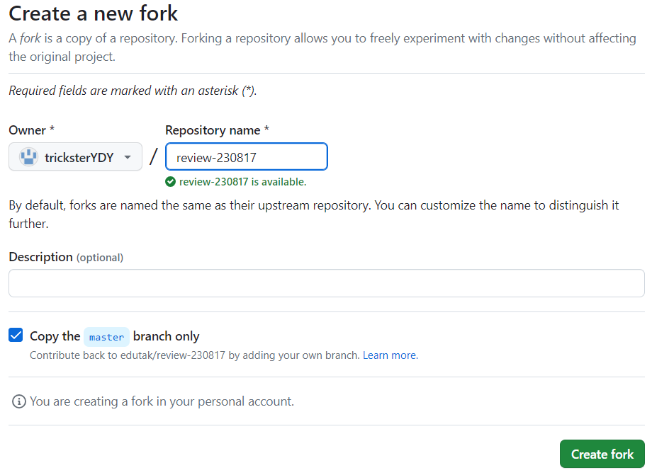
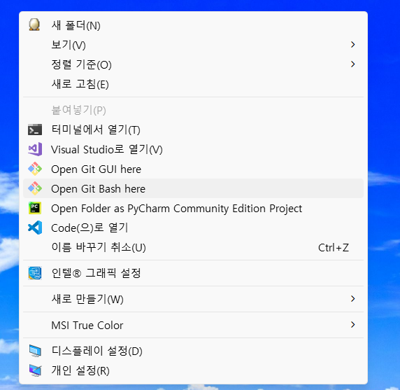
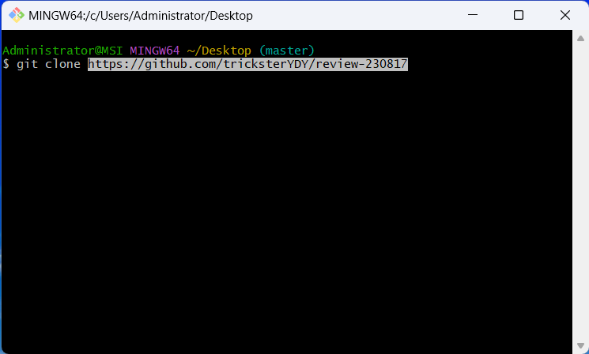
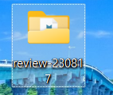
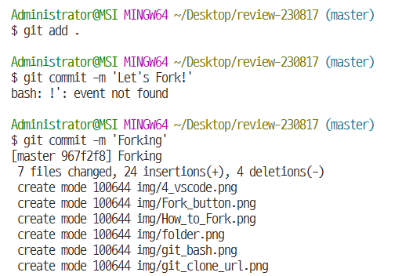
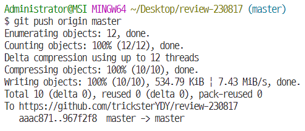
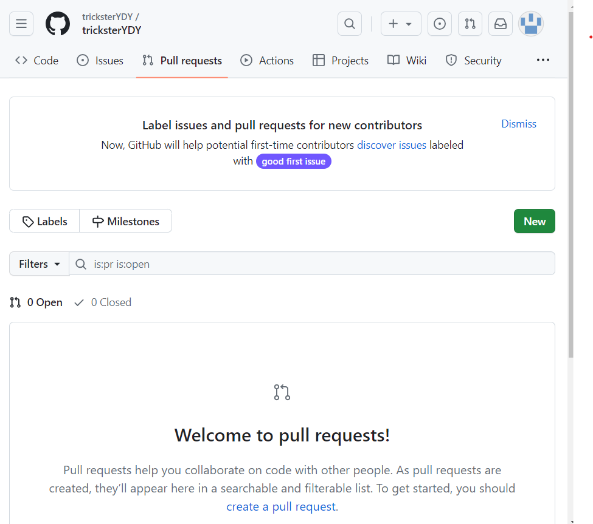

# Git/GitHub 특강 리뷰

## Fork 가이드

### (1) GitHub에서 Fork 버튼을 누른다.

### (2) 바탕화면에서 git bash를 연다음에 (우클릭) 'git clone https://url' 입력 후 엔터
1.

2.

### (3) 바탕화면에 review-230817 확인!!!

### (4) 그 폴더에서 VS Code 열고, 파일 만들고, 커밋하기

### (5) REPO에 업로드

### (6) GitHub 가셔서 Pull Request를 만들기

## ~~DONE!!~~